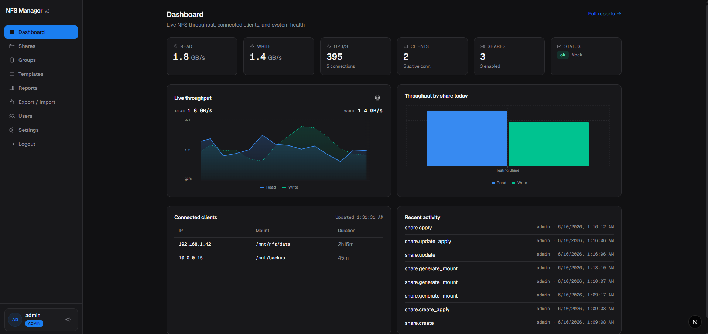
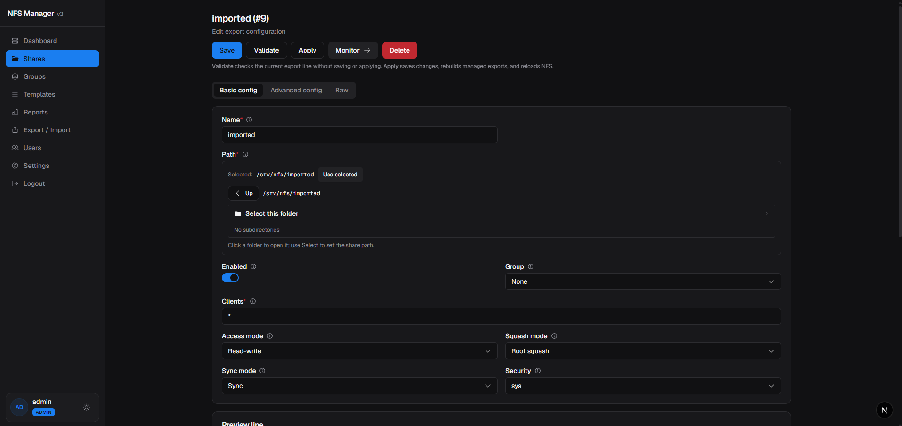
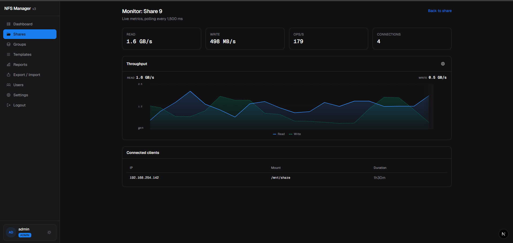
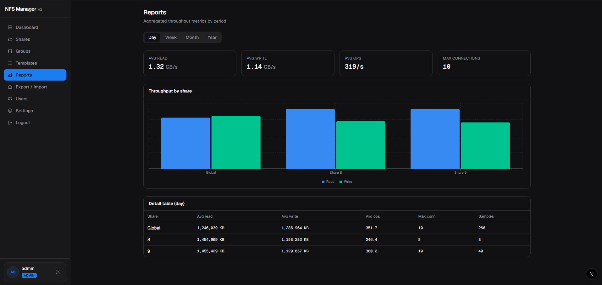

# NFS Manager v3

[](LICENSE)
[]()
[]()
[](backend/go.mod)
[](frontend/package.json)

**Manage NFS exports from a modern web UI — without living in `/etc/exports`.**

NFS Manager v3 is a self-hosted control plane for Linux NFS servers. It gives sysadmins and homelab operators a clear interface to create shares, validate export lines, apply changes safely, and monitor throughput — backed by a Go API, PostgreSQL, and a Next.js dashboard.

---

## Why NFS Manager?

Editing NFS exports by hand is error-prone and hard to audit. NFS Manager v3 centralizes that workflow:

- **Form-based configuration** for common export options (clients, squash modes, sync, security) with an advanced panel for power users
- **Raw export editing** when you need full control over `/etc/exports` syntax
- **Validate before apply** — syntax checks, path allowlists, and preview before touching the live server
- **Live monitoring** — throughput, ops/sec, connected clients, and per-share drill-down
- **Audit trail** — every apply, sync, and admin action is logged
- **Role-based access** — separate admin and read-only viewer accounts

---

## Features


| Area                 | What you get                                                              |
| -------------------- | ------------------------------------------------------------------------- |
| **Shares**           | Create, edit, enable/disable, and organize NFS shares by group            |
| **Templates**        | Reusable export presets to speed up new share setup                       |
| **Form & raw modes** | Guided forms or direct export-line editing; convert between modes         |
| **Apply workflow**   | Per-share or global validate → write managed file → `exportfs -ra` reload |
| **OS sync**          | Import existing exports from the host on startup or on demand             |
| **Monitoring**       | Real-time dashboard with live throughput charts and client tables         |
| **Reports**          | Day, week, month, and year rollups from stored metric samples             |
| **Users & RBAC**     | JWT auth with `admin` (full access) and `viewer` (read-only) roles        |
| **Dev-friendly**     | Mock NFS provider for development on Windows and macOS                    |


---

## Screenshots

| Dashboard | Share editor |
| --- | --- |
|  |  |

| Live monitor | Reports |
| --- | --- |
|  |  |


---

## Architecture

```
Browser → Next.js (3000) → REST /api/v3 → Gin API (8080) → PostgreSQL
                                      ↘ nfs.Provider → Linux tools | Mock store
```

- **Backend** — Go 1.22, Gin, pgx, golang-migrate, JWT authentication
- **Frontend** — Next.js 16 (App Router), React 18, Tailwind CSS, Recharts
- **Database** — PostgreSQL (users, shares, templates, audit log, metrics samples)
- **NFS integration** — Linux provider writes a managed exports file and reloads via `exportfs`; mock provider simulates exports and metrics for local dev

On Linux, managed exports are written to a dedicated file (default: `/etc/exports.d/nfs-manager.exports`) with `# BEGIN NFS-MANAGER` markers, keeping your hand-edited exports separate.

See [docs/ARCHITECTURE.md](docs/ARCHITECTURE.md) for package-level detail and [docs/API.md](docs/API.md) for the REST API reference.

---

## Requirements


| Component          | Version                                           |
| ------------------ | ------------------------------------------------- |
| Go                 | 1.22+                                             |
| Node.js            | 18+                                               |
| PostgreSQL         | 14+ recommended                                   |
| Linux (production) | `nfs-kernel-server` / `nfs-utils` with `exportfs` |


For development on non-Linux systems, set `NFS_PROVIDER=mock` to run without a real NFS server.

---

## Getting started

### 1. Clone and configure

```bash
git clone https://github.com/nfs-manager/nfs-manager-v3.git
cd nfs-manager-v3

cp backend/.env.example backend/.env
cp frontend/.env.example frontend/.env
```

Edit `backend/.env` with your PostgreSQL credentials and JWT secrets. At minimum, change `DATABASE_PASSWORD`, `JWT_ACCESS_SECRET`, and `JWT_REFRESH_SECRET`.

### 2. Run database migrations

```bash
cd backend && go run ./cmd/migrate up
```

### 3. Start the API

```bash
cd backend && go run ./cmd/server
```

On first startup with an empty database, the API seeds an `admin` user and prints a one-time password to the console:

```
FIRST RUN: admin user created
Username: admin
Password: <random>
```

Log in at `http://localhost:3000/login`, then change the password under **Settings**.

### 4. Start the frontend

```bash
cd frontend && npm install && npm run dev
```

Open [http://localhost:3000](http://localhost:3000).

### Quick start with Make

```bash
make dev          # migrate + backend + frontend (Linux with real NFS)
make dev-mock     # mock NFS provider (Windows / macOS dev)
```

---

## Docker

Run the full stack (API + Next.js UI + in-container NFS + PostgreSQL) from the repo root:

```bash
cp deploy/.env.example deploy/.env   # then edit secrets (see below)
make docker-up
```

Before first run, copy `deploy/.env.example` to `deploy/.env` and change these **required** values:

- `DATABASE_PASSWORD` — must match `POSTGRES_PASSWORD` so the API can connect
- `POSTGRES_PASSWORD` — PostgreSQL container password
- `JWT_ACCESS_SECRET` — access-token signing key (use a long random string)
- `JWT_REFRESH_SECRET` — refresh-token signing key (use a long random string)


| Service    | URL                                                                        |
| ---------- | -------------------------------------------------------------------------- |
| UI         | [http://localhost:3000/login](http://localhost:3000/login)                 |
| API health | [http://localhost:8080/api/v3/health](http://localhost:8080/api/v3/health) |
| NFS        | `localhost:${NFS_PORT:-2049}`                                              |


On first startup, check `docker compose -f deploy/docker-compose.yml logs app` for the one-time `admin` password.

The Docker image does **not** bake `NEXT_PUBLIC_API_BASE` at build time. Set `NEXT_PUBLIC_API_BASE` in `deploy/.env` (or compose environment); `entrypoint.sh` writes `/public/env.js` before starting Next.js.

Stop the stack:

```bash
make docker-down
```

**NFS client mount** (Linux client; Docker Desktop may need WSL2/Linux tooling):

```bash
sudo mkdir -p /mnt/nfs-test
sudo mount -t nfs -o vers=4.2,proto=tcp localhost:/srv/test /mnt/nfs-test
```

Export paths under `/srv` are bind-mounted from `deploy/srv/` for easy testing. The app container runs `privileged: true` so the kernel NFS daemon can start inside the container.

On Docker Desktop (Windows/macOS), in-container NFS may log `does not support NFS export` for bind-mounted paths; use a Linux host or WSL2 NFS client for full mount testing. The API and UI still run with `NFS_PROVIDER=linux`.

### Run with docker run

The app image bundles the API, Next.js UI, and in-container NFS server. **PostgreSQL is not included** — run a separate Postgres container (or external database) and point `DATABASE_`* at it.

**Build the image** from the repo root:

```bash
docker build -f deploy/Dockerfile -t nfs-manager-v3:latest \
  --build-arg NEXT_PUBLIC_APP_NAME="NFS Manager v3" .
```

**Minimal two-container setup** — create a user-defined network, start Postgres, then the app:

```bash
docker network create nfs-manager-net

# PostgreSQL (required)
docker run -d \
  --name nfs-manager-postgres \
  --network nfs-manager-net \
  -e POSTGRES_USER=nfsmanager \
  -e POSTGRES_PASSWORD=change-me \
  -e POSTGRES_DB=nfsmanager_v3 \
  -v nfs-manager-pgdata:/var/lib/postgresql/data \
  postgres:16-alpine

# Wait until Postgres accepts connections, then start the app
docker run -d \
  --name nfs-manager-app \
  --network nfs-manager-net \
  --privileged \
  -p 3000:3000 \
  -p 8080:8080 \
  -p 2049:2049 \
  -v nfs-share:/srv \
  -e DATABASE_HOST=nfs-manager-postgres \
  -e DATABASE_PORT=5432 \
  -e DATABASE_USER=nfsmanager \
  -e DATABASE_PASSWORD=change-me \
  -e DATABASE_NAME=nfsmanager_v3 \
  -e DATABASE_SSL_MODE=disable \
  -e JWT_ACCESS_SECRET=change-me-access-secret-min-32-chars \
  -e JWT_REFRESH_SECRET=change-me-refresh-secret-min-32-chars \
  -e JWT_ACCESS_TTL=15m \
  -e JWT_REFRESH_TTL=168h \
  -e API_PORT=8080 \
  -e APP_PORT=3000 \
  -e APP_ENV=production \
  -e CORS_ORIGIN=http://localhost:3000 \
  -e NEXT_PUBLIC_API_BASE=http://localhost:8080/api/v3 \
  -e NFS_SERVER_HOST=localhost \
  -e NFS_PORT=2049 \
  -e NFS_ROOT_ALLOWLIST=/srv,/data,/export,/mnt \
  nfs-manager-v3:latest
```


| Flag / setting              | Why                                                                         |
| --------------------------- | --------------------------------------------------------------------------- |
| `--privileged`              | Required for in-container kernel NFS (`rpc.nfsd`, `rpc_pipefs`)             |
| `-p 3000:3000`              | Next.js UI (`APP_PORT`)                                                     |
| `-p 8080:8080`              | Go API (`API_PORT`)                                                         |
| `-p 2049:2049`              | NFS server (`NFS_PORT`)                                                     |
| `-v …/deploy/srv:/srv`      | Bind-mount export paths for testing (same as compose)                       |
| `--network nfs-manager-net` | Lets `DATABASE_HOST=nfs-manager-postgres` resolve to the Postgres container |


On first startup, check logs for the one-time admin password:

```bash
docker logs nfs-manager-app
```

Replace every `change-me` value before production use. `DATABASE_PASSWORD` must match `POSTGRES_PASSWORD`. See [Docker environment variables](#docker-environment-variables) below for the full reference.

For docker-compose instead, use `make docker-up` as described above.

### Docker environment variables

The stack reads configuration from three places:

1. **Dockerfile** — baked defaults in the image (`ENV`) and one build-time arg (`NEXT_PUBLIC_APP_NAME`)
2. `**deploy/docker-compose.yml`** — service `environment` blocks override image defaults at runtime
3. `**deploy/.env`** — operator overrides via `env_file` on the `app` service and `${VAR}` substitution in compose

**Ports exposed** (host → container): `APP_PORT` (3000), `API_PORT` (8080), `NFS_PORT` (2049).

**Build vs runtime:** `NEXT_PUBLIC_APP_NAME` is compiled into the Next.js bundle during `docker build`. `NEXT_PUBLIC_API_BASE` is **not** baked at build time — `entrypoint.sh` writes `/app/frontend/public/env.js` from `NEXT_PUBLIC_API_BASE` before Next.js starts.

#### Build-time


| Variable               | Required | Default          | Description                                           | Set in                                                                   |
| ---------------------- | -------- | ---------------- | ----------------------------------------------------- | ------------------------------------------------------------------------ |
| `NEXT_PUBLIC_APP_NAME` | Optional | `NFS Manager v3` | Display name in the UI (baked into the Next.js build) | Dockerfile `ARG`/`ENV`, `docker-compose.yml` `build.args`, `deploy/.env` |


#### App container (runtime)


| Variable               | Required     | Default                              | Description                                                          | Set in                                                                                            |
| ---------------------- | ------------ | ------------------------------------ | -------------------------------------------------------------------- | ------------------------------------------------------------------------------------------------- |
| `API_PORT`             | Optional     | `8080`                               | API listen port                                                      | Dockerfile `ENV`, `docker-compose.yml` `environment`, `deploy/.env`, `entrypoint.sh`              |
| `APP_PORT`             | Optional     | `3000`                               | Next.js listen port                                                  | Dockerfile `ENV`, `docker-compose.yml` `environment`, `deploy/.env`, `entrypoint.sh`              |
| `APP_ENV`              | Optional     | `production`                         | Application environment (`dev` or `production`)                      | Dockerfile `ENV`, `docker-compose.yml` `environment`, `deploy/.env`, `config.go`                  |
| `DATABASE_HOST`        | Optional     | `postgres`                           | PostgreSQL hostname (compose service name)                           | `docker-compose.yml` `environment`, `deploy/.env`, `config.go`                                    |
| `DATABASE_PORT`        | Optional     | `5432`                               | PostgreSQL port                                                      | `docker-compose.yml` `environment`, `deploy/.env`, `config.go`                                    |
| `DATABASE_USER`        | Optional     | `nfsmanager`                         | PostgreSQL username for the API                                      | `docker-compose.yml` `environment`, `deploy/.env`, `config.go`                                    |
| `DATABASE_PASSWORD`    | **Required** | —                                    | PostgreSQL password for the API connection                           | `docker-compose.yml` `environment`, `deploy/.env`, `config.go`                                    |
| `DATABASE_NAME`        | Optional     | `nfsmanager_v3`                      | PostgreSQL database name                                             | `docker-compose.yml` `environment`, `deploy/.env`, `config.go`                                    |
| `DATABASE_SSL_MODE`    | Optional     | `disable`                            | PostgreSQL SSL mode                                                  | `docker-compose.yml` `environment`, `deploy/.env`, `config.go`                                    |
| `JWT_ACCESS_SECRET`    | **Required** | —                                    | Access-token signing key                                             | `docker-compose.yml` `environment`, `deploy/.env`, `config.go`                                    |
| `JWT_REFRESH_SECRET`   | **Required** | —                                    | Refresh-token signing key                                            | `docker-compose.yml` `environment`, `deploy/.env`, `config.go`                                    |
| `JWT_ACCESS_TTL`       | Optional     | `15m`                                | Access-token lifetime                                                | `deploy/.env` (`env_file`), `config.go`                                                           |
| `JWT_REFRESH_TTL`      | Optional     | `168h`                               | Refresh-token lifetime                                               | `deploy/.env` (`env_file`), `config.go`                                                           |
| `CORS_ORIGIN`          | Optional     | `http://localhost:3000`              | Allowed frontend origin for CORS                                     | `docker-compose.yml` `environment`, `deploy/.env`, `config.go`                                    |
| `NFS_SERVER_HOST`      | Optional     | `localhost`                          | Hostname shown in health checks and mount hints                      | `docker-compose.yml` `environment`, `deploy/.env`, `config.go`                                    |
| `NFS_PORT`             | Optional     | `2049`                               | NFS server port (`rpc.nfsd`)                                         | Dockerfile `ENV`, `docker-compose.yml` `environment`, `deploy/.env`, `entrypoint.sh`, `config.go` |
| `NFS_ROOT_ALLOWLIST`   | Optional     | `/srv,/data,/export,/mnt`            | Comma-separated allowed export path roots                            | Dockerfile `ENV`, `docker-compose.yml` `environment`, `deploy/.env`, `config.go`                  |
| `MANAGED_EXPORTS_PATH` | Optional     | `/etc/exports.d/nfs-manager.exports` | Managed exports file inside the container                            | Dockerfile `ENV`, `docker-compose.yml` `environment`, `deploy/.env`, `config.go`                  |
| `NEXT_PUBLIC_API_BASE` | Optional     | `http://localhost:8080/api/v3`       | API base URL for the browser (written to `public/env.js` at runtime) | `docker-compose.yml` `environment`, `deploy/.env`, `entrypoint.sh`                                |


#### PostgreSQL service


| Variable            | Required     | Default         | Description                     | Set in                                            |
| ------------------- | ------------ | --------------- | ------------------------------- | ------------------------------------------------- |
| `POSTGRES_USER`     | Optional     | `nfsmanager`    | PostgreSQL role name            | `docker-compose.yml` `environment`, `deploy/.env` |
| `POSTGRES_PASSWORD` | **Required** | —               | PostgreSQL container password   | `docker-compose.yml` `environment`, `deploy/.env` |
| `POSTGRES_DB`       | Optional     | `nfsmanager_v3` | Database created on first start | `docker-compose.yml` `environment`, `deploy/.env` |


---

## Native Linux install

For production on a Linux NFS host, use the install helper (requires root):

```bash
sudo bash scripts/install-linux.sh
```

This script:

- Installs NFS server utilities if missing
- Builds the API binary to `/usr/local/bin/nfs-manager-api`
- Runs migrations
- Builds the frontend
- Creates a `systemd` unit at `/etc/systemd/system/nfs-manager-api.service`

Enable the API service:

```bash
sudo systemctl enable --now nfs-manager-api
```

Serve the frontend with `npm run start` in `frontend/`, or place it behind a reverse proxy (nginx, Caddy, etc.).

---

## Configuration

### Backend (`backend/.env`)


| Variable                                   | Description                               | Default                              |
| ------------------------------------------ | ----------------------------------------- | ------------------------------------ |
| `API_PORT`                                 | API listen port                           | `8080`                               |
| `DATABASE_*`                               | PostgreSQL connection                     | see `.env.example`                   |
| `JWT_ACCESS_SECRET` / `JWT_REFRESH_SECRET` | Token signing keys                        | **change in production**             |
| `NFS_SERVER_HOST`                          | Hostname shown in health/mount hints      | system hostname                      |
| `NFS_PORT`                                 | NFS server port (`rpc.nfsd`)              | `2049`                               |
| `NFS_ROOT_ALLOWLIST`                       | Comma-separated allowed export path roots | `/srv,/data,/export,/mnt`            |
| `CORS_ORIGIN`                              | Allowed frontend origin                   | `http://localhost:3000`              |


### Frontend (`frontend/.env`)


| Variable               | Description                                                           |
| ---------------------- | --------------------------------------------------------------------- |
| `NEXT_PUBLIC_API_BASE` | API base URL for local dev (Docker writes `public/env.js` at runtime) |
| `NEXT_PUBLIC_APP_NAME` | Display name in the UI                                                |
| `APP_PORT`             | Next.js listen port (Docker / production)                             |


---

## Contributing

Contributions are welcome. This project is in pre-release, so expect API and UI changes as Docker packaging and polish land.

1. Fork the repository
2. Create a feature branch (`git checkout -b feature/my-change`)
3. Commit with a clear message
4. Open a pull request against `main`

Please keep changes focused and match existing code style. For larger changes, open an issue first to discuss scope.

---

## License

MIT License — Copyright (c) 2026 Tuan Vo Minh (TuiTenTuan). See [LICENSE](LICENSE) for the full text.

---

## Author

**Tuan Vo Minh** ([@TuiTenTuan](https://github.com/TuiTenTuan))

Built for teams and homelabs that want NFS management to feel as straightforward as the rest of their infrastructure tooling.